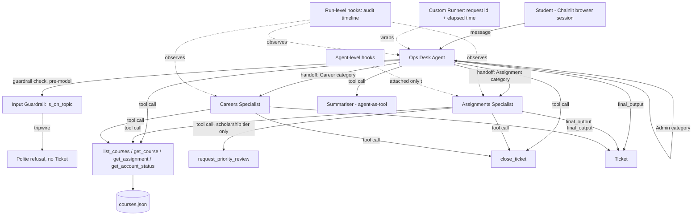
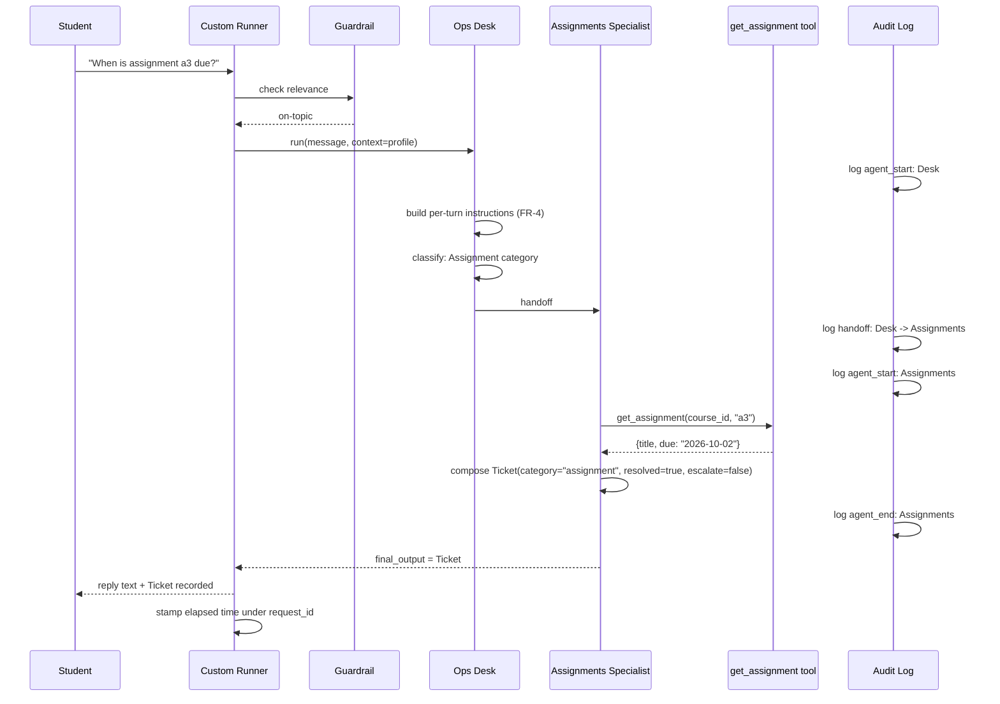

# Plan — Saylani Student Ops Desk

**Version:** 1.0.0
**Governs:** Architecture and technical design. Every decision here MUST satisfy every requirement
in `spec.md` without violating any article of `constitution.md`. Where this document names a
concrete number, name, or library convention, that choice is binding for `tasks.md`.

---

## 1. Architecture Overview



## 2. Agents

| Agent | Role | Model | Instructions | Output type | Handoff targets |
|---|---|---|---|---|---|
| **Ops Desk** | Entry point, classifier, Admin answerer | `gemini-2.5-flash`, moderate temperature (e.g. 0.4) | Built per-turn from `StudentProfile` (FR-4) | `Ticket` | Assignments, Careers |
| **Base Specialist** | Not exposed directly; exists only to be cloned | `gemini-2.5-flash`, baseline settings | Generic placeholder, always overridden by clones | `Ticket` | — |
| **Assignments Specialist** | Answers assignment/schedule/policy questions | Cloned from Base; low temperature (e.g. 0.1) for factual precision | Cold, factual, cites the exact policy/date returned by tools; never speculates | `Ticket` | none (leaf) |
| **Careers Specialist** | Answers career-guidance questions | Cloned from Base; higher temperature (e.g. 0.7) | Warmer, encouraging, may offer general advice alongside course-specific facts | `Ticket` | none (leaf) |
| **Summariser** | Condenses long policy text to ≤3 lines | `gemini-2.5-flash`, low temperature | Single-purpose: compress, never add new claims | plain text (not a `Ticket` — it is a tool, not a conversational endpoint) | — (exposed to Desk as a tool, not a handoff target) |

**Design decision — why Assignments/Careers are handoffs and Summariser is a tool.** A handoff
transfers *authorship* of the reply to the student — appropriate when the specialist's voice and
judgment should be what the student sees. Summariser never speaks to the student directly; its
output is consumed by the Desk and re-presented in the Desk's own voice, so it is exposed as a
callable capability (`agent.as_tool(...)`), not a handoff target.

**Design decision — category tie-break implementation.** The Desk's instructions state the
precedence explicitly (Assignment > Career > Admin, per `spec.md` §4.5) so the classification
decision the model makes is guided by a deterministic rule rather than left to unconstrained
judgment call to call.

## 3. Tools / Capabilities

| Name | Owner agent(s) | Parameters (model-supplied) | Context read internally | Returns | Failure behavior |
|---|---|---|---|---|---|
| `list_courses` | Desk, Assignments, Careers | none | no | list of `{id, title}` | Returns empty list with an explanatory string if the data source is unreadable — never raises |
| `get_course` | Desk, Assignments, Careers | `course_id: str` | no | title, schedule, policies | Returns a not-found string if the id is absent from the data source |
| `get_assignment` | Assignments | `course_id: str`, `assignment_id: str` | no | title, due date | Returns a not-found string if either id is absent |
| `get_account_status` | Desk | *(none)* | **yes** — reads `context.tier`, `context.open_tickets` | short status string | Cannot fail under normal operation; a missing context is a programmer error caught by the type system, not a runtime path |
| `summarise_policy` (via Summariser-as-tool) | Desk | `text: str` | no | ≤3-line summary | Returns `"nothing to summarize"` for empty/whitespace input |
| `request_priority_review` | Assignments, Careers | short justification string | **yes** — only included in the tool list when `context.tier == "scholarship"` | acknowledgement string | Not present in the tool list at all for `"regular"` tier — this is a list-construction decision, not a runtime refusal |
| `close_ticket` | Desk, Assignments, Careers | the five `Ticket` fields (§ `spec.md` 4.7) | no | the validated `Ticket`; ends the run immediately | Invalid/incomplete fields fail Pydantic validation, surfaced the same way as any other structured-output failure |

`get_account_status` is the capability that satisfies `spec.md` FR-3's acceptance criterion: its
generated schema has **zero parameters**, because everything it needs comes from the run context,
never from the model.

## 4. Data Structures

### 4.1 `StudentProfile` (local run context)

```python
from dataclasses import dataclass, field

@dataclass
class StudentProfile:
    name: str
    roll_no: str
    course_id: str
    tier: str = "regular"       # "regular" | "scholarship" — validated in __post_init__
    open_tickets: int = 0        # validated >= 0 in __post_init__

    def __post_init__(self) -> None:
        if self.tier not in ("regular", "scholarship"):
            raise ValueError(f"Invalid tier: {self.tier!r}")
        if self.open_tickets < 0:
            raise ValueError("open_tickets cannot be negative")
```

Validation happens at construction time (before any run starts), per `spec.md` §4.3 — this is a
binding implementation detail, not an implementation-defined choice.

### 4.2 `Ticket` (structured final output)

```python
from typing import Literal
from pydantic import BaseModel, Field

class Ticket(BaseModel):
    category: Literal["assignment", "career", "admin"]
    summary: str = Field(min_length=1)
    next_step: str = Field(min_length=1)
    resolved: bool
    escalate: bool
```

### 4.3 `courses.json` (course data source)

```json
{
  "courses": [
    {
      "id": "agentic-ai-w4",
      "title": "Agentic AI - weekdays batch 4",
      "schedule": "Mon-Thu, 7-9pm",
      "policies": {"late_submission": "48 hours, 20% penalty"},
      "assignments": [
        {"id": "a3", "title": "First coded agent", "due": "2026-10-02"}
      ]
    }
  ]
}
```

Read fresh on every tool call (not cached for process lifetime), so a deletion from the file is
reflected on the very next lookup, satisfying `spec.md` FR-2's edge case.

## 5. Guardrail Design (FR-8)

A lightweight input-guardrail agent (small, cheap model call, or a rules-based check — implementer's
choice, documented in `tasks.md`) classifies the incoming message as on-topic or off-topic *before*
the Desk agent is invoked. On off-topic, it raises the SDK's guardrail tripwire.

The tripwire is caught at exactly one place: the top-level message handler (both the terminal loop
in Phase 1 and the Chainlit handler in Phase 3). On catch, a fixed, polite refusal string is sent to
the student and the turn ends — no `Ticket` is produced (per `spec.md` §4.7 edge case).

Because the guardrail is a separate, smaller check that runs *before* the Desk's own model call, an
off-topic turn never reaches — and therefore never bills — the Desk's primary model, satisfying
`constitution.md` Article VI.3.

## 6. Hooks Design (FR-10)

- **Run-level hooks** (`RunHooks`) are registered once per run and record, in order: agent start,
  agent end, handoff (from → to), and tool start/end for every tool call, across every agent
  involved. This produces the single ordered timeline required by FR-10.
- **Agent-level hooks** (`AgentHooks`) are attached only to the **Assignments Specialist** (Design
  decision, `spec.md` §4.10). They fire only while that specific agent holds the conversation, and
  naturally produce nothing while the Desk or Careers specialist is active — this is the expected
  behavior to explain in the viva, not a bug.
- Both hook sets append structured entries to the durable audit log described in §9 below
  (NFR-3) — printing to the terminal alone does not satisfy the requirement.

## 7. Custom Runner Design (FR-11 — cut-list priority 1)

A subclass (or thin wrapping function) around the SDK's run mechanism generates a `request_id`
(e.g. `uuid4()`), records a start timestamp, invokes the underlying run unchanged, and records
elapsed time on completion — logging both alongside the request id. It is registered once, at
process startup, and no agent definition file imports or references it, satisfying `spec.md`
FR-11's acceptance criterion.

## 8. Turn Ceiling (FR-9c)

**Design decision — ceiling value: 10 turns.**

Rationale: a typical resolved conversation — classification, one tool call, possibly one handoff,
one more tool call, and a final `Ticket` — takes 2 to 6 turns. A ceiling of 10 gives comfortable
headroom for a legitimately complex exchange (e.g. a clarifying follow-up) while still bounding the
worst-case cost of a malfunctioning loop to a small, fixed number of model calls. This number and
its rationale are exactly what FR-9's acceptance criterion requires being able to name and justify.

## 9. Persistence for the Audit Trail (NFR-3)

The audit timeline (§6 above) is appended, one JSON object per line, to an `audit_log.jsonl` file at
the project root (or an equivalent durable store, e.g. a local SQLite table, if the implementer
prefers — either satisfies NFR-3; `audit_log.jsonl` is the default assumed by `tasks.md`). Each line
carries at minimum: `request_id`, `timestamp`, `agent_name`, `event_type`, and `detail`.

## 10. Tracing Design (FR-13)

Tracing is enabled for every run and exported using the developer's own tracing key from `.env`
(never hardcoded — Article II of `constitution.md`). The trace's workflow/group identifier is set to
the same `request_id` used by the custom runner (§7), so that the Desk's portion and any handed-off
specialist's portion of one student conversation are unambiguously grouped into a single trace.

## 11. Chainlit Session Design (FR-12)

- `on_chat_start`: constructs exactly one `StudentProfile` and stores it, along with an empty
  conversation-history list, in the session-scoped store (e.g. `cl.user_session`) — never in a
  module-level or global variable, which would leak across sessions.
- `on_message`: appends the incoming message to that session's history, `await`s the run (never the
  synchronous variant — this is the exact failure mode probed by the viva's Question 5), appends the
  result, and renders the reply.
- Because state lives entirely in the session store, two concurrently open browser sessions are
  isolated by construction, satisfying `spec.md` FR-12's acceptance criterion without extra
  bookkeeping.

## 12. Sequence Diagram — One Full Conversation With a Handoff



## 13. Summary of Binding Design Decisions (for quick viva reference)

| Decision point | Choice | Why |
|---|---|---|
| Terse-mode threshold | `open_tickets >= 3` | Explicit, inclusive boundary — no ambiguity |
| Category tie-break | Assignment > Career > Admin | Deterministic, testable |
| Specialist with `AgentHooks` | Assignments | Higher real-world cost if wrong |
| Turn ceiling | 10 | Covers realistic worst case, bounds runaway cost |
| Scholarship-only tool | `request_priority_review` | Concrete, demonstrable tier-gating example |
| Audit persistence | `audit_log.jsonl` | Durable, trivially inspectable, satisfies NFR-3 |
| Trace grouping key | shared `request_id` | Guarantees one conversation = one trace (FR-13) |
